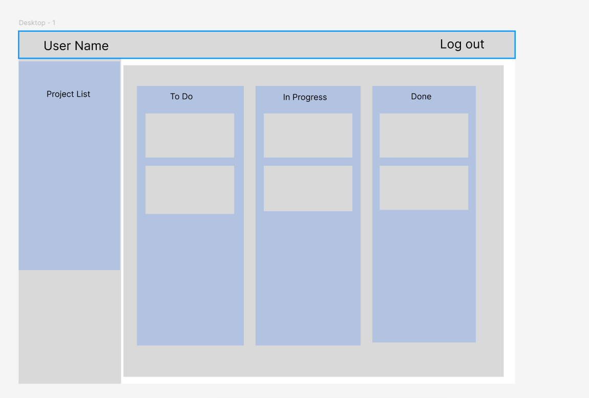
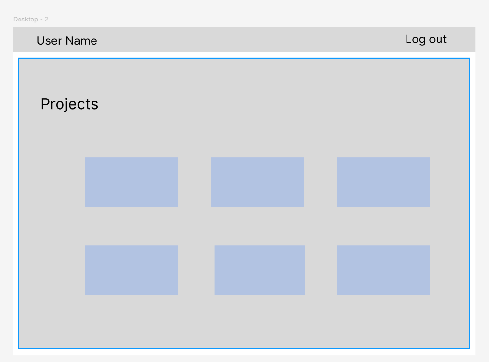

# Project Title : Project Management App

## Overview

What is your app? Brief description in a couple of sentences.
:- The project management app will enhance team collaboration, streamline task tracking, and optimize project workflows through intuitive design and robust features, ultimately increasing project efficiency and success rates."

### Problem

Why is your app needed? Background information around any pain points or other reasons.
:- A Project Management app is needed to help teams organize their project progress tracking and task allocation. Centralizing task management improves efficiency, enhances team coordination, and ensures the project stays on track and is completed before the deadline.

### User Profile

Who will use your app? How will they use it? Any special considerations that your app must take into account.
:- This application will be used by project managers and team members to keep track of their ongoing projects.

### Features

List the functionality that your app will include. These can be written as user stories or descriptions with related details. Do not describe _how_ these features are implemented, only _what_ needs to be implemented.
:-This app will include the following functionality

1. Login
2. Signup
3. Project creation
4. create and assign a task
5. Display tasks
6. Updating the status of an ongoing task

### Tech Stack

List technologies that will be used in your app, including any libraries to save time or provide more functionality. Be sure to research any potential limitations.

1. React
2. React Router
3. axios
4. sass
5. Node.js
6. Express
7. Database
8. Dnd kit

### Sitemap

List the pages of your app with brief descriptions. You can show this visually, or write it out.

1. Signup Page:- allows users to sign up
2. Login Page:- allows users to login
3. Home Page:- Users can create a new project and view existing projects
4. Task board:- user can view tasks

### Mockups

Provide visuals of your app's screens. You can use tools like Figma or pictures of hand-drawn sketches.

### Data

Describe your data and the relationships between them. You can show this visually using diagrams, or write it out.
Tables:
1.Users
2.Projects
3.Tasks

The user's table and Projects will be linked through user ID and tasks will be connected to both users and projects through userId and projectId respectively.

### Endpoints

List endpoints that your server will implement, including HTTP methods, parameters, and example responses.

EndPoints:-
get users(/users) :- response: list of users
get singleUser(/users/id):- response: one perticular user
get projects(/projects):- response: list of projects
get SingleProject(/projects/id) response: single project information
post(/projects/): response : create a new project
put (/projects/projectId):- response: update a project
delete(/projects/projectId):- response: delete a project
get(/tasks):- response: list of tasks
get (/tasks/taskId) response: single task information
post(/tasks): response : create a new task
put (/tasks/taskId):- response: update a task
delete(/tasks/taskId):- response: delete a task

### Auth

Does your project include any login or user profile functionality? If so, describe how authentication/authorization will be implemented.

yes, users will be able to signup and login (using jwt)

## Roadmap

Scope your project as a sprint. Break down the tasks that will need to be completed and map out timeframes for implementation. Think about what you can reasonably complete before the due date. The more detail you provide, the easier it will be to build.

Sprint1:-
initial set up for both front end and back end
set up database
user registration and login functionality

Sprint2:-
add functionality to show, create, update, and delete projects front-end and backend

Sprint3:-
add functionality to show, create, update, and delete tasks front-end and backend.

## Nice-to-haves

Your project will be marked based on what you committed to in the above document. Under nice-to-haves, you can list any additional features you may complete if you have extra time, or after finishing.

:- Add functionality for users to add comments for tasks
